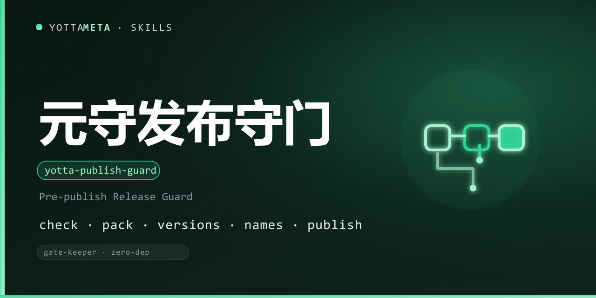

<p align="center"><b>Language</b>: <a href="./README.md">English</a> · 中文</p>

<p align="center">
  
</p>

<h1 align="center">yotta-publish-guard · 元守 (YuanShou)</h1>

<p align="center"><b>通用发布前守门</b>（默认 YottaMeta 归属，可自定义为任意发布组织）：把「发布规范 + 已踩过的坑」固化成确定性 CLI ——
<code>check</code>（聚合校验，full / github / self 三档模式）· <code>pack</code>（npm pack 打包检查）·
<code>versions</code>（版本五件对齐）· <code>names</code>（名称三通道查重）·
<code>publish</code>（发布命令封装 + 推送闸门）。<b>零其他依赖（Python 3.8+ 标准库）</b>；
Windows + Linux + macOS 通用。</p>
<p align="center">触发场景：发布技能前、改完技能准备推 GitHub / npm / ClawHub 时、
想批量核对版本或查重名称时；或说 元守 / 发布守门 / 发布前检查 / publish-guard / 推前检查 / 查重 / 版本对齐 等。</p>

<p align="center">
  <a href="LICENSE"></a>
  <a href="https://agentskills.io/"></a>
  <a href="https://www.npmjs.com/package/@yottameta/yotta-publish-guard"></a>
  <a href="https://github.com/YottaMeta/yotta-publish-guard"></a>
  <a href="https://github.com/YottaMeta/yotta-publish-guard/commits/main"></a>
  <a href="https://github.com/YottaMeta/yotta-publish-guard"></a>
</p>

## 这是什么

在 GitHub / npm / ClawHub 三源发布一个技能，要跨十几个检查点：发布规范校验、四个文件的版本对齐、
npm pack 无 pyc、三个通道的名称查重、git 代理参数、ClawHub 引号、gh --description。
元守把「能不能发了」这一整件事变成一条命令，并把实际发布步骤封装在默认阻断的推送闸门之后。

## 命令

```bash
# 1) 发布就绪检查（full 档；可聚合元安 / 元审 / 元信 verdict）
python3 scripts/yotta_publish_guard.py check ./yotta-my-tool
python3 scripts/yotta_publish_guard.py check ./yotta-my-tool --with-audit --with-vetter --with-verify
python3 scripts/yotta_publish_guard.py check ./yotta-private --self-use

# 2) 打包检查 / 版本五件对齐 / 名称三通道查重
python3 scripts/yotta_publish_guard.py pack ./yotta-my-tool
python3 scripts/yotta_publish_guard.py versions ./yotta-my-tool
python3 scripts/yotta_publish_guard.py names ./yotta-my-tool

# 3) 发布命令封装（默认 dry-run 打印计划；--exec 执行；--force 显式跳过闸门）
python3 scripts/yotta_publish_guard.py publish ./yotta-my-tool
python3 scripts/yotta_publish_guard.py publish ./yotta-my-tool --github-only
python3 scripts/yotta_publish_guard.py publish ./yotta-my-tool --channels github,npm --exec
```


## 归属配置（可自定义）

默认校验 / 发布命令面向 YottaMeta 归属（npm `@yottameta` / GitHub `YottaMeta` / ClawHub `yottameta` / topic `yottaskills`），开箱即用。
其他发布组织可改为自己的归属（npm scope / GitHub org / ClawHub owner / topic），改后校验、查重、发布命令全部按新归属生成；
归属经 CLI 参数或环境变量指定，使用本技能的 AI 会按需引导配置。
本技能不持有、不读取任何平台凭据——npm / gh / clawhub 的发布鉴权由各平台 CLI 按使用者本机配置完成。

## 三档校验模式

| 模式 | 触发方式 | 要求 |
|---|---|---|
| full | `check` 默认 / `publish` 全渠道 | SKILL.md + LICENSE + README 中英四方式 + package.json + CHANGELOG（建议）+ 版本五件 + 无占位符 + 围栏 |
| github | `publish --github-only` | SKILL.md + LICENSE + README.md（英文）；不强制 npm 发布件 |
| self | `check --self-use` | 只查技能本体：SKILL.md + frontmatter + 无占位符 + 围栏 |

## 子命令速览

- **check**：内置校验（三档模式）+ 可选聚合元安 / 元审 / 元信 verdict（未安装自动降级提示）。
- **pack**：`npm pack --dry-run` 检查——包内无 pyc / __pycache__、关键文件（SKILL / LICENSE / README 中英）在包内；npm 不可用本地回退。
- **versions**：package.json / SKILL.md frontmatter / SKILL.md 正文版本行（如存在）/ CHANGELOG 顶部 / CLI `VERSION` 常量五件对齐。
- **names**：npm view / gh repo view / clawhub search 三通道查重；网络失败降级为手动查重提示。
- **publish**：生成发布命令计划（git init/add/commit → gh repo create --description + topic yottaskills → npm publish → clawhub publish），clawhub publish 默认 `--owner yottameta` 归属 org（`--clawhub-owner` 可改，防止误发到个人账号），默认 dry-run，`--exec` 按序执行，`--force` 显式跳过推送闸门。

## 发布渠道（可选）

`publish --channels github,npm,clawhub`（缺省全渠道）或 `--github-only`——npm / ClawHub
都不是必选，只推 GitHub 时闸门用 github 档。

## 推送闸门

`publish` 前先跑内置校验：有 ERROR 默认阻断（退出码 2）；`--force` 仅显式授权后可用。

## 退出码

| 子命令 | 0 | 1 | 2 | 其它 |
|---|---|---|---|---|
| check | READY | READY（含 WARN 建议） | BLOCKED | 4 致命异常 |
| pack | PASS | — | 包内 pyc 或关键文件缺失 | 4 致命异常 |
| versions | PASS | — | 缺失 / 不一致 | 4 致命异常 |
| names | 三通道全部空闲 | 有渠道无法确认（需手动查重） | 有 TAKEN | 4 致命异常 |
| publish | dry-run 或执行成功 | — | 闸门阻断 / 渠道参数错误 | 执行中失败命令的退出码；4 致命异常 |

## 行为锚点

1. **推送闸门默认阻断**：未通过校验不得发布，`--force` 仅显式授权后可用。
2. **网络命令优雅降级**：npm / gh / clawhub 不可用时输出「需手动查重」提示，不伪造结果。
3. **只读**：不修改被测技能目录（除 npm pack 临时产物）；git init / commit 仅在 `--exec` 时执行。
4. **平台适配**：Windows 下 .cmd/.bat 子进程经 cmd.exe 执行；npm 命令使用可写 --cache 目录。

## 与工坊 / 工具链分工

| 技能 | 职责 |
|---|---|
| 元守 yotta-publish-guard（本技能） | **守**：发布前全量校验 + 发布命令封装 |
| 元造 yotta-skill-creator | **造**：生成合规脚手架（元守的 `check` 对元造脚手架直接 READY） |

推荐链路：**元造 create → 人工开发 → 元守 check → pack → versions → names → publish**。

参考资料：`references/tutorial.md`（中文教程）、`references/check-items.md`（校验项明细）、
`references/publish-flow.md`（三源发布流程与已踩坑清单）。

## 安装

以下四种方式任选，顺序即推荐优先级；技能文件一律从 **npm** 获取（GitHub 无代理较慢，npm 支持镜像）。

### 方式一：npm 一行装（推荐）

```text
# 可选国内加速：npm config set registry https://registry.npmmirror.com
npx -y @yottameta/yotta-publish-guard --agent <智能体名称>      # 装到指定智能体默认用户级技能目录
npx -y @yottameta/yotta-publish-guard --dir <智能体的技能目录>  # 指到技能目录本身（如 ~/.codex/skills）
```

- `--agent <name>` 自动装到该智能体默认用户级目录；`--list` 可查看各智能体默认目录。
- `--dir <路径>` 装到指定的技能目录；未收录的智能体用 `--dir` 指到它的技能目录。
- npmmirror 未同步新包（404）：加 `--registry=https://registry.npmjs.org/`（国内需代理），或稍等镜像缓存。

### 方式二：git clone（开发者 / 有 git 环境）

```text
git clone https://github.com/YottaMeta/yotta-publish-guard.git <智能体的技能目录>/yotta-publish-guard
```

### 方式三：GitHub 下载压缩包（手动 / 无 git 环境）

在 GitHub 仓库 `YottaMeta/yotta-publish-guard` 点 **Code → Download ZIP**，解压后把
`yotta-publish-guard` 文件夹放进智能体技能目录。

### 方式四：install.sh（多智能体一键脚本）

```text
bash install.sh --agent <name>   # 装到指定智能体默认用户级目录
bash install.sh --dir <path>     # 装到指定目录
bash install.sh --list           # 列出智能体 -> 默认目录
```

> 方式一走 npm 源（npmmirror / npmjs），不依赖 GitHub；方式二 / 三走 GitHub，国内无代理可能失败。

## 开发与校验

技能包自带测试脚本（随发布包一起分发）：

```bash
# 在技能目录内跑全量用例（36 个）
python scripts/test_yotta_publish_guard.py
```

## 许可证

MIT © YottaMeta —— 见 [LICENSE](./LICENSE)。
